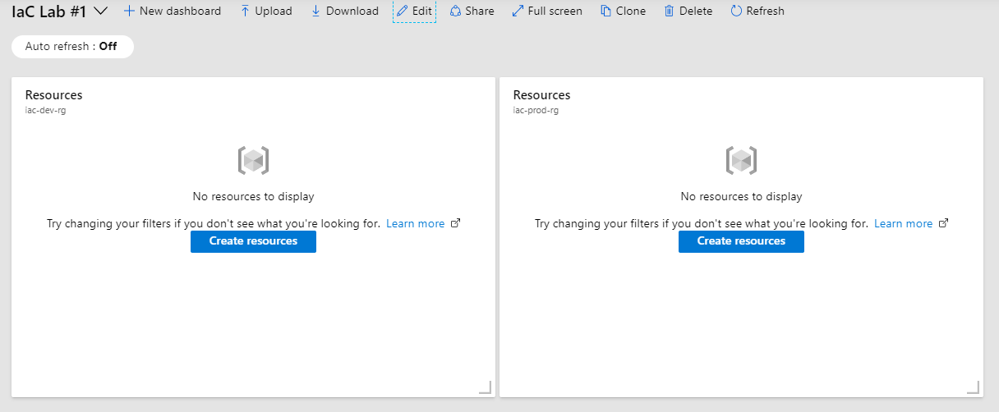

# Lab-01 - create resource groups

During this lab you will create 2 resource groups and new dashboard at the portal. Please check our [naming conventions](../../naming-conventions.md).

## Tips

Every time you don't remember what `az` commands available or what are the arguments for the selected command, you can add `--help` attribute to get help. Here are some examples:

```bash
# Show list of all commands available
az --help

# Show list of subgroups and commands available under the group `resource`
az group --help

# Show list of arguments available for create resource group command
az group create --help
```

az cli support auto completion, just start typing command and press `Tab` and if command exists, it will be auto completed.

If you double `Tab`, az cli will show you list of commands or arguments available at the current context, sort of light version of `--help` flag.

## Task #1

Create resource group for `dev` environment.

```bash
az group create -n iac-dev-rg -l westeurope --tags owner=team-platform env=dev description="Workshop #1 resources for dev environment"
```

## Task #2

Create resource group for `prod` environment.

```bash
az group create -n iac-prod-rg -l westeurope --tags owner=team-platform env=prod description="Workshop #1 resources for production environment"
```

## Task #3

Create Azure portal dashboard for newly created resource groups.

Go to [Azure portal](https://portal.azure.com/) and create new dashboard followed by the [following instructions](https://docs.microsoft.com/en-us/azure/azure-portal/azure-portal-dashboards). Let's call this dashboard `IaC Lab #1`. 

Find resource group `iac-dev-rg` and pin it to the dashboard by clicking pin icon  at the top right corner of resource group window next to the close icon .

Find resource group `iac-prod-rg` and pin it to the dashboard by clicking pin icon  at the top right corner of resource group window next to the close icon .

After you successfully done this, your dashboard should like this:

