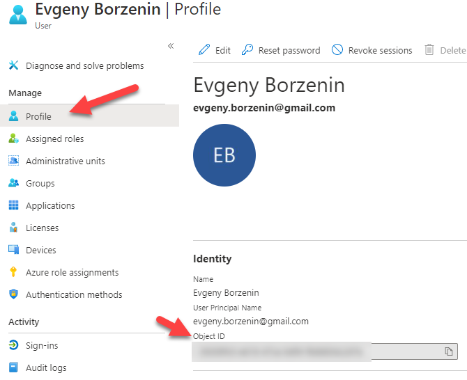

# lab-06 - managing secrets with Azure Key-Vault

## Estimated completion time - ?? min

The Pulumi Service automatically manages per-stack encryption keys on your behalf. Anytime you encrypt a value using `--secret` or by programmatically wrapping it as a secret at runtime, a secure protocol is used between the CLI and Pulumi Service that ensures secret data is encrypted in transit, at rest, and physically anywhere it gets stored.

The default encryption mechanism may be insufficient in the following scenarios:

* If you are using the Pulumi CLI independent of the Pulumi Service—either in local mode, or by using one of the available backend plugins.

* If your team already has a preferred cloud encryption provider that you would like to use.

In both cases, you can continue using secrets management as described above, but instruct Pulumi to use an alternative encryption provider, in our case Azure Key-Vault.

## Goals

* To configure Pulumi to use Azure Key Vault as an encryption provider.

## Useful links

* [Pulumi: Configuring Secrets Encryption](https://www.pulumi.com/docs/intro/concepts/config/#configuring-secrets-encryption)
* [Pulumi: Azure Key Vault as Encryption Provider](https://www.pulumi.com/docs/intro/concepts/config/#azure-key-vault)
* [Pulumi: Managing Secrets with Pulumi](https://www.pulumi.com/blog/managing-secrets-with-pulumi/)
* [Pulumi: Configuring your secrets provider](https://www.pulumi.com/blog/managing-secrets-with-pulumi/#configuring-your-secrets-provider)
* [Managing Deployment Secrets with Azure Key Vault](https://cloud-right.com/2020/06/pulumi-encrypt-secrets-azure-keyvault)
* [Azure Key Vault](https://docs.microsoft.com/en-us/azure/key-vault/?WT.mc_id=AZ-MVP-5003837)
* [Azure Environment Authentication](https://docs.microsoft.com/en-us/azure/developer/go/azure-sdk-authorization?WT.mc_id=AZ-MVP-5003837#use-environment-based-authentication)

## Task #1 - create new Azure key-vault and new keyvault key

Note!

Azure Key-Vault names **MUST** be globally unique. Do not use key-vault name I used in the code below, create your own name. 
I suggest the following convention: 

iac-***usr***-pulumi-encryption-kv, where `usr` is short version of your username, in my case, I will use `iac-evg-pulumi-encryption-kv`

```bash
$ az group create --name iac-pulumiinfra-rg --location westeurope
$ az keyvault create --name iac-evg-pulumi-kv --resource-group iac-pulumiinfra-rg --location westeurope
$ az keyvault key create --name pulumiencryptionkey --vault-name iac-evg-pulumi-kv
```

Retrieve your user' object ID and grant a Key Vault Access Policy to this user to access Keys. You can find your user object ID either at the Azure portal. Navigate to `Azure Active Directory -> Users -> <Your user> -> Profile` and copy `Object ID`



or use `az cli`

```bash
$ userId=`az ad user show --id evgeny.borzenin@gmail.com | jq -r .objectId`
$ az keyvault set-policy --name iac-evg-pulumi-kv --object-id ${userId} --key-permissions encrypt decrypt get create delete list update import backup restore recover
```

You have now created an Azure Key-Vault with an Encryption Key.


## Task #2 - configure pulumi to use Azure Key-Vault

We use `azurekeyvault` provider and it uses an Azure Key Vault key for encryption. This key is specified using an Azure Key object identifier, which includes both your key vault’s name and the key to use: `azurekeyvault://keyvaultname.vault.azure.net/keys/keyname`.

By default, `azurekeyvault` provider will use [Azure Environment Authentication](https://docs.microsoft.com/en-us/azure/developer/go/azure-sdk-authorization?WT.mc_id=AZ-MVP-5003837#use-environment-based-authentication).

We want to login using the `az cli` for authentication instead, therefore we should set `AZURE_KEYVAULT_AUTH_VIA_CLI` environment variable to `true`.

```bash
$ export AZURE_KEYVAULT_AUTH_VIA_CLI=true
$ pulumi stack init --secrets-provider="azurekeyvault://iac-evg-pulumi-kv.vault.azure.net/keys/pulumiencryptionkey"
```

You can now verify that Pulumi has configured our Key Vault Encryption Key by looking at the Pulumi.dev.yaml file.

```bash
$ cat Pulumi.dev.yaml
secretsprovider: azurekeyvault://iac-evg-pulumi-kv.vault.azure.net/keys/pulumiencryptionkey
encryptedkey: b05XWS1ScU1OcHAtYnZpR1lZbDBFeHN2U1Nob2RZb2lPQUk2WHpUQzNmRmQzbW1nWHp3WE1...
```

## Task #3 - cleanup

Destroy all resources

```bash
$ pulumi destroy
```

and remove `dev` stack

```bash
$ pulumi stack rm dev
```

## Next: import existing resources

[Go to lab-07](../lab-07/readme.md)
